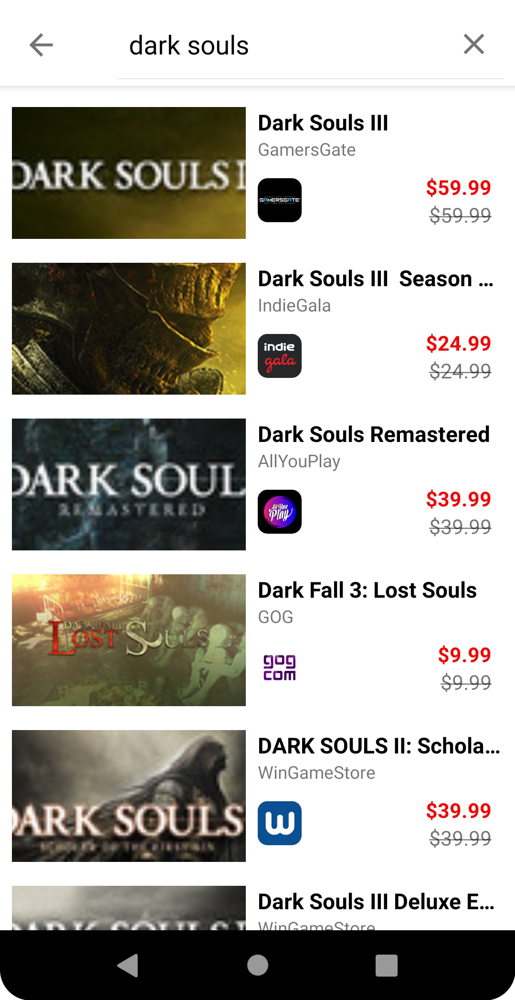

# Cheap Pc Games
Cheap Pc Games is a modern Android Application that show the different deals about computer games from different stores where you can save
a specific deal to show later also you can search a specific video game or filter for specific stores.

In this project I developed modern Android Development with:
 - MVVM architecture
 - Kotlin Coroutines
 - Fragment
 - Flow
 - Jetpack (View Model, Room)
 - Retrofit
 - Coil
 - Gson
 - Material Design

## 📷 Previews

 
 
 
 
 
 
 

## 🏛️ Architecture
Cheap Pc Games is based on the MVVM architecture and the Repository pattern.

## Open Api

Cheap Pc Games using the [CheapSharkApi](https://apidocs.cheapshark.com/)

[CheapShark](https://www.cheapshark.com/) is a price comparison website for digital PC Games. They keep track of prices across multiple stores including Steam, GreenManGaming, Fanatical, and many others.

They offer a fully documented public API for developers to use CheapShark pricing data on their own app or website.

## 🛠 Tech stack & Open-source libraries
- Minimum SDK level 21
- [Kotlin](https://kotlinlang.org/), [Coroutines](https://github.com/Kotlin/kotlinx.coroutines) + [Flow](https://kotlin.github.io/kotlinx.coroutines/kotlinx-coroutines-core/kotlinx.coroutines.flow/) for asynchronous.
- Jetpack
  - Lifecycle - Observe Android lifecycles and handle UI states upon the lifecycle changes.
  - ViewModel -  Designed to store and manage UI-related data in a lifecycle conscious way. Allows data to survive configuration changes such as screen rotations.
  - DataBinding - Data Binding Library is a support library that allows you to bind UI components in your layouts to data sources in your app using a declarative format rather than programmatically.
  - Room Persistence - Constructs Database by providing an abstraction layer over SQLite to allow fluent database access.
- Architecture
  - MVVM Architecture (View - DataBinding - ViewModel - Model)
  - Repository Pattern
- [Retrofit2 & OkHttp3](https://github.com/square/retrofit) - Construct the REST APIs.
- [Coil](https://github.com/coil-kt/coil) - Loading images from network
- [Gson](https://github.com/google/gson) - Java library that can be used to convert Java/Kotlin Objects into their JSON representation

## 💯 MAD Score
 
 